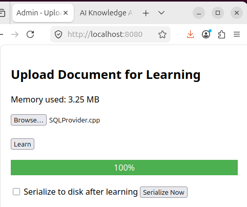

# neural
simple C++ neural network service

## Overview
now it can run as master process with all neural network functional and two child processes admin for training, client for question-answer functional.
all gui in html over http in browser. admin localhost:8080, client localhost:8081.

\
\


### Build System
- **CMake 3.16+**: now only testing on linux

```
./build.sh
```
# running
```
cd build && ./neural
```
