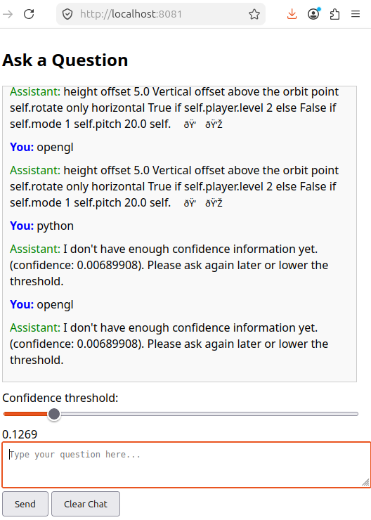

# neural
simple C++ neural network service

## Overview
now it can run as master process with all neural network functional and two child processes admin for training, client for question-answer functional.
all gui in html over http in browser. admin localhost:8080, client localhost:8081.

\


### requirements
[ASIO](http://think-async.com) ([asio github](https://github.com/chriskohlhoff/asio))
[SQlite](https://sqlite.org)
[spdlog](https://github.com/gabime/spdlog)
[nlohmann/json](https://github.com/nlohmann/json)

### Build System
- **CMake 3.16+**: now only testing on linux

```
./build.sh
```
### running
```
cd build && ./neural
```
in browser goto admin panel ```http://localhost:8080```\
and client panel ```http://localhost:8081```\
also you can use OpenAI compatibility reguests
```
curl -X POST http://localhost:8081/v1/chat \
  -H "Content-Type: application/json" \
  -d '{"model":"neural","messages":[{"role":"user","content":"What is Python?"}]}'
```
